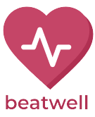

<h1 align="center"> BeatWell </h1>  

  

  Smart health mobile app to prevent coronary heart disease to support
 Sustainable Development Goals

  

<!-- START doctoc generated TOC please keep comment here to allow auto update -->
<!-- DON'T EDIT THIS SECTION, INSTEAD RE-RUN doctoc TO UPDATE -->

## Table of Contents

- [Introduction](#introduction)
- [Features](#features)
- [Feedback](#feedback)
- [Contributors](#contributors)
- [Build Process](#build-process)
- [Backers](#backers-)
- [Sponsors](#sponsors-)
- [Acknowledgments](#acknowledgments)

<!-- END doctoc generated TOC please keep comment here to allow auto update -->

## Introduction

View repository and user information, control your notifications and even manage your issues and pull requests. Built with React Native, GitPoint is one of the most feature-rich unofficial GitHub clients that is 100% free.

**Available on Android.**

  

## Features

A few of the things you can do with BeatWell:

- Early prediction for CHD risk
- Health monitoring from the CHD risk
- Daily healthy food recomendation
- Daily activity recomendation
- Daily news about health

  

## Contributors

This project is capstone project for Bangkit Academy Batch 2 2024 with our members:

1. Wikan Haydarrahman
2. Arfiana Maulidiyah
3. Silvi Nurcahyaningsih
4. Alifian
5. Ahmad Hamid
6. Naufal Muhammad

## Acknowledgments

this is not the main repositories, this is just a remote repositories, you can find the main repositories :    
The models : <a href="https://github.com/Kannnnz/BeatWell-Models"> Model Repositories</a>  
The API : <a href="https://github.com/alif40550/BeatWell-API"> API Repositories </a>  
The App : <a href="https://github.com/nopal72/beatWell-apps "> App Repositories </a>
